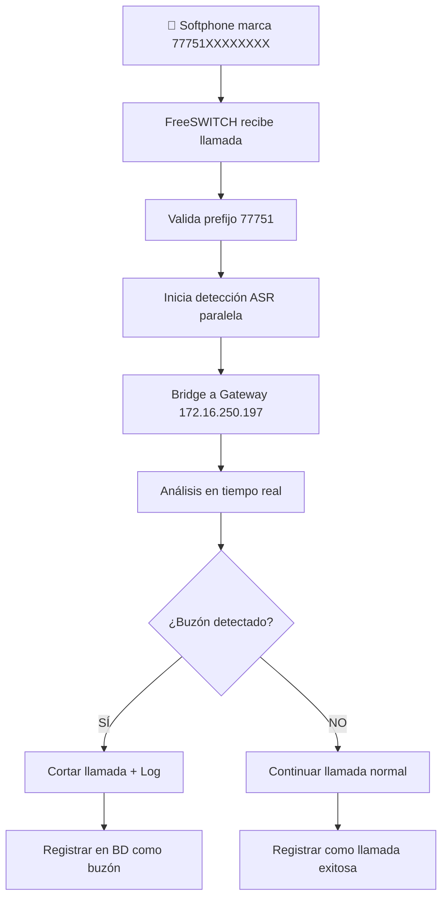

# 🔄 Guía de Pruebas - Detección de Buzones Post-Answer

## 🎯 Flujo Actualizado de Detección

### ⚡ **NUEVO**: Detección Post-Conexión
El sistema ahora detecta buzones **DESPUÉS** de establecer la conexión:

1. **📞 Llamada**: `77751XXXXXXXX` desde extensión 1001
2. **🔗 Bridge inmediato**: Se conecta al gateway `172.16.250.197`
3. **⏱️ Análisis 3s**: Una vez respondida, analiza primeros 3 segundos
4. **🛑 Corte automático**: Error `503 Service Unavailable` si detecta buzón
5. **✅ Continúa**: Llamada normal si detecta humano

## 📋 Configuración Implementada

### 🌐 Gateway Saliente
- **IP**: `172.16.250.197`
- **Prefijo de Autorización**: `77751`
- **Usuario/Password**: `77751` / `77751`
- **Nombre Gateway**: `voicemail_detection_gw`

### 👤 Extensión de Prueba
- **Número**: `1001`
- **Password**: `1001`
- **Detección**: Habilitada automáticamente
- **Timeout**: 3 segundos exactos post-answer

## 🚀 Cómo Realizar Pruebas

### 1. **Configurar Softphone**

#### Configuración SIP:
```
Servidor SIP: [IP_DE_TU_FREESWITCH]
Puerto: 5060
Usuario: 1001
Password: 1001
Dominio: [IP_DE_TU_FREESWITCH]
Protocolo: UDP
```

#### Ejemplo con X-Lite/Bria:
```
Display Name: VM Tester
User Name: 1001
Password: 1001
Domain: 192.168.1.100  (IP de tu FreeSWITCH)
```

#### Ejemplo con Zoiper:
```
Hostname: 192.168.1.100:5060
Username: 1001
Password: 1001
Outbound Proxy: (vacío)
```

### 2. **Realizar Llamadas de Prueba**

#### Formato de Números:
```
77751XXXXXXXX

Donde:
- 77751 = Prefijo de autorización
- XXXXXXXX = Número destino (7-15 dígitos)
```

#### Ejemplos de Llamadas:
```bash
# Llamada real a través del gateway
777511234567890

# Números de prueba locales (simulan buzones)
777519999  # Buzón de prueba 1
777518888  # Buzón de prueba 2  
777517777  # Buzón de prueba 3
```

### 3. **Flujo de Detección en Llamadas Salientes**



## 🔍 Monitoreo y Debugging

### Logs en Tiempo Real
```bash
# Logs de FreeSWITCH
docker logs -f freeswitch-detector | grep "OUTBOUND_BRIDGE_DETECTOR"

# Logs específicos de detección
docker logs -f freeswitch-detector | grep "VOICEMAIL_DETECTOR"

# Logs de gateway
docker logs -f freeswitch-detector | grep "voicemail_detection_gw"
```

### Verificar Estado del Gateway
```bash
# Conectar a fs_cli
docker exec -it freeswitch-detector fs_cli

# Verificar estado del gateway
fs> sofia status gateway voicemail_detection_gw

# Ver registros SIP
fs> sofia global siptrace on

# Ver llamadas activas
fs> show calls
```

### Comandos de Debugging
```bash
# En fs_cli - verificar configuración
fs> reload mod_sofia
fs> sofia profile external restart

# Verificar dialplan
fs> show dialplan

# Test de conectividad al gateway
fs> originate sofia/gateway/voicemail_detection_gw/777517777 &echo
```

## 📊 Casos de Prueba Actualizados

### 🎯 Caso 1: Detección de Buzón Post-Answer
```bash
1. Marcar desde softphone: 777511234567890
2. ✅ Bridge se establece inmediatamente al gateway
3. ⏱️  Una vez respondida → inicia análisis automático (3s)
4. 🛑 Si detecta buzón → corte con 503 Service Unavailable
5. 📝 Logs muestran: "BUZÓN CONFIRMADO - CORTANDO INMEDIATAMENTE"
```

### ✅ Caso 2: Llamada a Humano
```bash
1. Marcar desde softphone: 777519876543210
2. Si contesta persona real
3. Observar logs: debe identificar como humano
4. Resultado esperado: Llamada continúa normal
```

### Caso 3: Números de Prueba Local
```
1. Marcar: 777519999 (buzón simulado)
2. Debe reproducir audio de buzón falso
3. Sistema debe detectar patrones de buzón
4. Resultado: Detección exitosa + registro
```

### Caso 4: Llamada No Contesta
```
1. Marcar número que no contesta
2. Timeout después de 60 segundos
3. Resultado: Registro como "no_answer"
```

## 📈 Métricas a Observar

### En Base de Datos
```sql
-- Ver últimas detecciones en llamadas salientes
SELECT 
    call_id, 
    caller_number, 
    destination_number,
    detection_result,
    confidence_score,
    call_duration_seconds,
    detected_at
FROM detection_logs 
WHERE caller_number = '1001' 
ORDER BY detected_at DESC 
LIMIT 10;

-- Estadísticas de efectividad
SELECT 
    detection_result,
    COUNT(*) as count,
    AVG(confidence_score) as avg_confidence
FROM detection_logs 
WHERE caller_number = '1001'
GROUP BY detection_result;
```

### En Logs de FreeSWITCH
```bash
# Buscar patrones específicos
grep "BUZÓN DETECTADO" /var/log/freeswitch/freeswitch.log
grep "bridge_result_action" /var/log/freeswitch/freeswitch.log
grep "voicemail_detection_gw" /var/log/freeswitch/freeswitch.log
```

## 🔧 Configuraciones Avanzadas

### Ajustar Umbrales de Detección
```xml
<!-- En directory/default/1001_voicemail_tester.xml -->
<variable name="detection_confidence_threshold" value="80"/>
<variable name="detection_timeout" value="20"/>
```

### Configurar Codecs Específicos
```xml
<!-- En sip_profiles/external/voicemail_detection_gw.xml -->
<param name="codec-prefs" value="PCMU,PCMA"/>
```

### Habilitar Grabación Completa
```lua
-- En outbound_bridge_with_detection.lua
local config = {
    enable_recording = true,  -- Cambiar a false para desactivar
    detection_timeout = 30,   -- Ajustar timeout
    debug_mode = true        -- Cambiar a false en producción
}
```

## 🎯 Escenarios de Prueba Específicos

### Test 1: Buzón Personal
- **Número**: 777515551234567
- **Patrón esperado**: "Hola, has llamado a [nombre]..."
- **Resultado**: Detección con alta confianza (>90%)

### Test 2: Buzón Empresarial  
- **Número**: 777515552345678
- **Patrón esperado**: "Gracias por llamar a [empresa]..."
- **Resultado**: Detección con confianza media-alta (80-90%)

### Test 3: IVR (No es buzón)
- **Número**: 777515553456789  
- **Patrón esperado**: "Para ventas marque 1..."
- **Resultado**: NO debe detectar como buzón

### Test 4: Contestador Automático
- **Número**: 777515554567890
- **Patrón esperado**: "Después del tono, deje su mensaje"
- **Resultado**: Detección con alta confianza (>85%)

## 🚨 Troubleshooting

### Problema: Gateway no registra
```bash
# Verificar conectividad
docker exec freeswitch-detector ping 172.16.250.197

# Verificar configuración
fs> sofia status gateway voicemail_detection_gw
```

### Problema: Llamadas no salen
```bash
# Verificar dialplan
fs> show dialplan context default

# Test manual
fs> originate user/1001 &echo
```

### Problema: No detecta buzones
```bash
# Verificar mod_vosk
fs> module_exists mod_vosk

# Verificar servidor Vosk
curl -v ws://vosk-voicemail:2800
```

### Problema: Detección incorrecta
```sql
-- Revisar patrones en BD
SELECT * FROM voicemail_patterns WHERE is_active = true;

-- Ajustar pesos de confianza
UPDATE voicemail_patterns 
SET confidence_weight = 0.95 
WHERE pattern_text LIKE '%deja tu mensaje%';
```

## 📝 Checklist de Implementación

- [x] Gateway configurado (172.16.250.197)
- [x] Extensión 1001 creada
- [x] Dialplan para prefijo 77751 implementado
- [x] Script Lua de detección en bridge
- [x] Números de prueba locales
- [x] Logs y debugging configurados
- [x] Base de datos preparada
- [x] Documentación completa

## 🎉 ¡Sistema Listo para Pruebas!

Tu sistema ya puede:

✅ **Recibir registros** de softphone en extensión 1001  
✅ **Procesar llamadas salientes** con prefijo 77751  
✅ **Conectar al gateway** 172.16.250.197  
✅ **Detectar buzones** en tiempo real durante bridge  
✅ **Cortar llamadas** cuando detecta buzón  
✅ **Registrar estadísticas** en base de datos  
✅ **Continuar llamadas normales** cuando detecta humanos  

**¡Prueba marcando 777519999 desde tu softphone para ver el sistema en acción!**